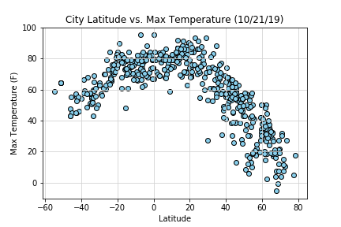
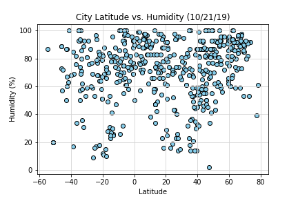
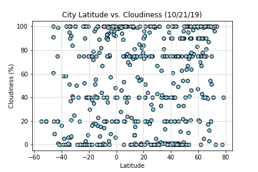
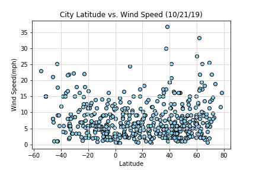

# OpenWeather API Project

The purpose of this project was to create a Python script to visualize the weather of 500+ cities across the world of varying distance from the equator. Randomly selected the cities to produce the results.

OpenWeather API key was required in order to complete.

The objective wass to build a series of scatter plots to showcase the following relationships:

Temperature (F) vs. Latitude
Humidity (%) vs. Latitude
Cloudiness (%) vs. Latitude
Wind Speed (mph) vs. Latitude

Final Jupyter Notebook displays the following:

Randomly select at least 500 unique (non-repeat) cities based on latitude and longitude.
Performed a weather check on each of the cities using a series of successive API calls.
Included a print log of each city as it's being processed with the city number and city name.
Saved both a CSV of all data retrieved and png images for each scatter plot.

    |    

    |    

